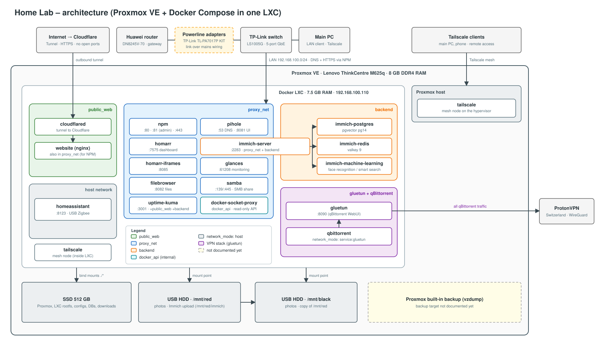
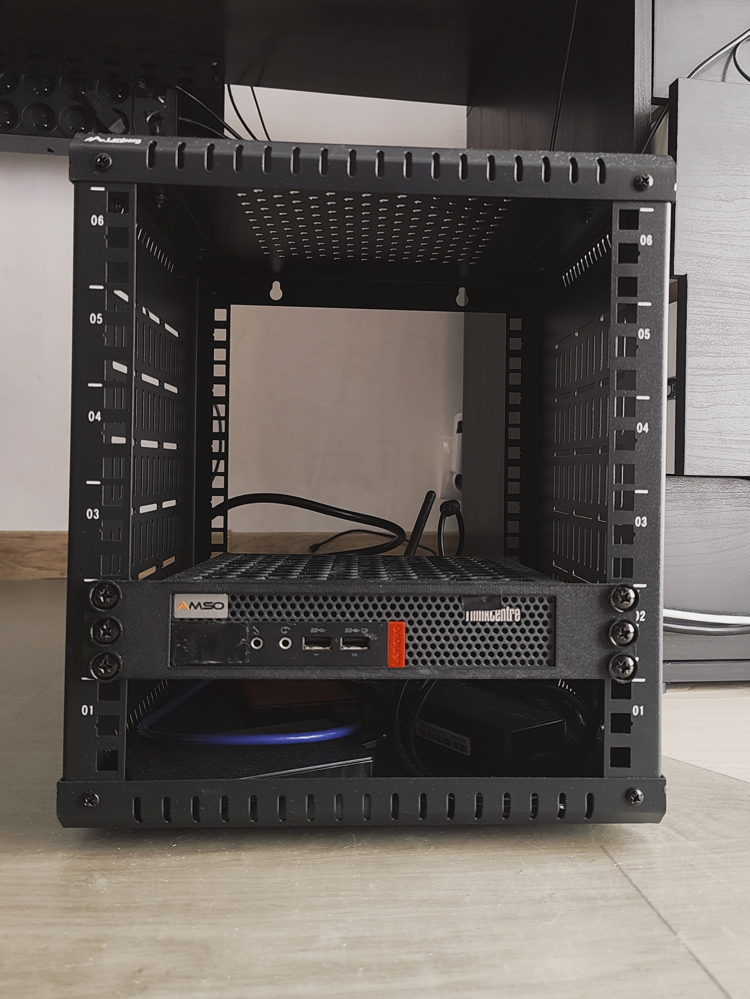
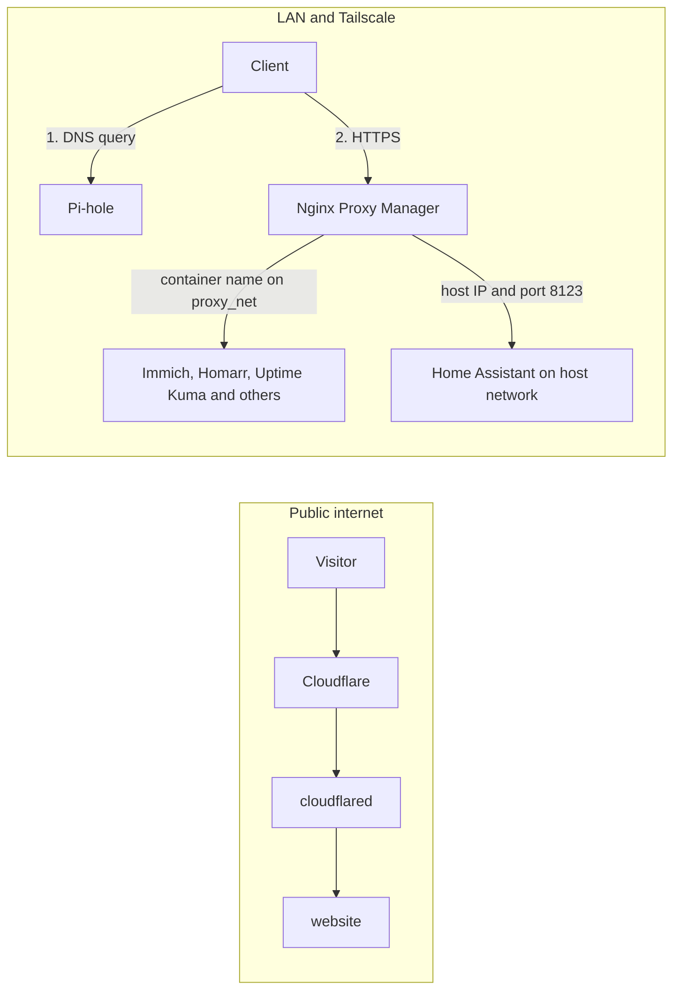

# 🏠 Homelab — Proxmox + Docker Compose


[](LICENSE)

A self-hosted home lab on a single **Lenovo M625q** mini PC. Proxmox VE runs one LXC container with the whole Docker Compose stack: photos (Immich), smart home (Home Assistant), network-wide ad blocking and local DNS (Pi-hole), reverse proxy (Nginx Proxy Manager), a public website behind a Cloudflare Tunnel, torrenting through a VPN, and monitoring. Remote access is provided by **Tailscale**.



> Hostnames, Tailscale addresses and secrets in this repository are placeholders (`example.com`, `100.64.x.x`). Real values live in a local, git-ignored `.env`.

## Contents

1. [Hardware](#1-hardware)
2. [Virtualization](#2-virtualization)
3. [Networking and access](#3-networking-and-access)
4. [Services](#4-services)
5. [Security model](#5-security-model)
6. [VPN isolation](#6-vpn-isolation)
7. [Storage and backup](#7-storage-and-backup)
8. [Configuration and secrets](#8-configuration-and-secrets)
9. [Getting started](#9-getting-started)
10. [Operations](#10-operations)
11. [Design decisions](#11-design-decisions)
12. [Notes and gotchas](#12-notes-and-gotchas)
13. [Repository layout](#13-repository-layout)
14. [Roadmap](#14-roadmap)

## 1. Hardware

| Component | Details |
|---|---|
| Compute | Lenovo ThinkCentre M625q (mini PC / thin client), 8 GB DDR4 RAM |
| System disk | 1× 512 GB SSD (Proxmox, LXC root filesystem, service configs and databases, downloads) |
| Data disks | 2× USB HDD: `/mnt/red` (photos) and `/mnt/black` (copy of the photos) |
| Network | Huawei DN8245V-70 router → TP-Link TL-PA7017P KIT powerline adapters → TP-Link LS1005G switch → mini PC (static IP) and main PC |

### 📸 The Rack

<!--
Add your own photos here — drop image files into ./docs/images/ and update the paths below.
Recommended: 1-4 photos, resized to ~1200px wide so the README stays fast to load.
-->

<p align="center">
  
  
</p>

<p align="center">
  <em>Lenovo M625q + switch + network gear</em>
</p>

## 2. Virtualization

- **Hypervisor:** Proxmox VE, with 0.5 GB of RAM reserved for the host.
- **Docker host:** a single LXC container running Ubuntu with Docker. It gets the remaining 7.5 GB of RAM, all CPU cores and the rest of the SSD.
- **Storage access:** `/mnt/red` and `/mnt/black` are mounted on the Proxmox host and passed into the LXC as mount points.
- **Zigbee dongle:** passed through to the LXC and then to the Home Assistant container (`HA_USB_DEVICE`).
- **Source of truth:** everything inside the LXC is defined by [`docker-compose.yml`](docker-compose.yml).

## 3. Networking and access

| Layer | Solution |
|---|---|
| Physical | Huawei DN8245V-70 router → TP-Link TL-PA7017P KIT powerline adapters (link over the home mains wiring) → TP-Link LS1005G switch → mini PC (static IP) and main PC |
| LAN | `192.168.100.0/24`; the Docker LXC has a static address (`192.168.100.110`) |
| DNS | Pi-hole serves the LAN and resolves local names such as `immich.example.com` and `pve.example.com` |
| Reverse proxy | Nginx Proxy Manager terminates HTTPS for internal services |
| Public exposure | Cloudflare Tunnel (`cloudflared`) publishes **only** the static `website`; no ports are opened on the router |
| Remote access | Tailscale, installed on the Proxmox host, inside the Docker LXC, on the main PC and on a phone |

### Traffic flow



### Docker networks

| Network | Services |
|---|---|
| `public_web` | `cloudflared`, `website` |
| `proxy_net` | `npm`, `pihole`, `website`, `homarr`, `homarr-iframes`, `glances`, `filebrowser`, `samba`, `immich-server`, `gluetun`, `uptime-kuma` |
| `backend` | `immich-server`, `immich-postgres`, `immich-redis`, `immich-machine-learning`, `uptime-kuma` |
| `docker_api` (internal) | `docker-socket-proxy`, `homarr`, `glances` |
| `host` | `homeassistant` (needs mDNS and direct access to the Zigbee dongle) |
| `service:gluetun` | `qbittorrent` (shares Gluetun's network stack) |

## 4. Services

| Service | Image | Host ports | Purpose | Memory limit |
|---|---|---|---|---|
| `website` | `nginx:alpine` | – | Static public site (via Cloudflare Tunnel, and via NPM on the LAN) | 64 MB |
| `cloudflared` | `cloudflare/cloudflared` | – | Outbound tunnel to Cloudflare | 64 MB |
| `immich-server` | `immich-server:release` | – | Photo management | 1536 MB |
| `immich-postgres` | `pgvector/pgvector:pg14` | – | Immich database | 1024 MB |
| `immich-redis` | `valkey/valkey:9` | – | Immich cache and queues | 256 MB |
| `immich-machine-learning` | `immich-machine-learning:release` | – | Face recognition, smart search | 1536 MB |
| `pihole` | `pihole/pihole` | 53 TCP/UDP, 8081 | LAN DNS and ad blocking | 150 MB |
| `npm` | `jc21/nginx-proxy-manager` | 80, 443, 81 (LAN IP only) | Reverse proxy | 512 MB |
| `homeassistant` | `home-assistant:stable` | host (8123) | Smart home, Zigbee | 500 MB |
| `docker-socket-proxy` | `tecnativa/docker-socket-proxy` | – | Read-only Docker API for dashboards | 32 MB |
| `homarr` | `homarr-labs/homarr` | – | Dashboard | 300 MB |
| `homarr-iframes` | `diogovalentte/homarr-iframes` | – | iframe widgets for Homarr | 64 MB |
| `glances` | `nicolargo/glances` | – | Host resource monitoring | 100 MB |
| `uptime-kuma` | `louislam/uptime-kuma` | – | Service availability monitoring | 150 MB |
| `filebrowser` | `filebrowser/filebrowser` | – | Web file manager | 80 MB |
| `gluetun` | `qmcgaw/gluetun` | 8090 | VPN client (ProtonVPN, WireGuard, Switzerland) | 1024 MB |
| `qbittorrent` | `linuxserver/qbittorrent` | via gluetun | Torrent client | 1536 MB |
| `samba` | `dperson/samba` | 139, 445 | SMB share of the downloads directory | 150 MB |

Services without published ports are reached by Nginx Proxy Manager over `proxy_net`. Limits are caps, not reservations: they add up to more than the 7.5 GB of RAM because the peaks do not coincide.

Two optional custom services (`kindle`, `rss`) build from local directories and sit behind the `custom` Compose profile; they are not part of this documentation.

## 5. Security model

| Exposure | What |
|---|---|
| Public internet | Only `website`, through the Cloudflare Tunnel. No router port forwarding. |
| LAN | NPM (80/443), Pi-hole DNS (53), Samba (139/445), qBittorrent UI (8090). NPM's admin UI (81) is bound to the LAN IP only. |
| Tailscale | Private remote access to everything above, from my own devices. |
| VPN | Only qBittorrent traffic leaves through ProtonVPN. |

- **No raw Docker socket in dashboards.** Homarr and Glances talk to `docker-socket-proxy` (read-only, internal network) instead of mounting `docker.sock`.
- **Secrets** live only in `.env` (git-ignored). CI runs a secret scan (gitleaks) on every push.
- **Network separation:** `cloudflared` can only reach `public_web`, so it cannot reach NPM or the admin UI.
- **Known trade-offs:** `uptime-kuma` spans `proxy_net` and `backend` so it can monitor both; `gluetun` shares `proxy_net` so NPM can reach the qBittorrent UI.

## 6. VPN isolation

- All internet traffic of `qbittorrent` goes through the `gluetun` container (`network_mode: "service:gluetun"`). If the ProtonVPN tunnel drops, qBittorrent loses connectivity instead of leaking traffic.
- `gluetun` only serves qBittorrent. Immich and Home Assistant do not use the VPN.
- This is isolation of **outbound internet traffic**, not network segmentation: `FIREWALL_OUTBOUND_SUBNETS` allows the LAN and Tailscale nodes so the qBittorrent WebUI stays reachable.
- **Port forwarding:** Gluetun requests a forwarded port from ProtonVPN and pushes it into qBittorrent through its API.

## 7. Storage and backup

| Location | Contents |
|---|---|
| SSD (directory next to `docker-compose.yml`) | Service configs, databases (Pi-hole, NPM, Uptime Kuma, Immich Postgres), qBittorrent downloads |
| `/mnt/red/immich` | Immich photo library (uploads) |
| `/mnt/black` | Copy of the photos from `/mnt/red` |

- **Container and LXC backups:** Proxmox's built-in backup (vzdump).
- **Photos:** replicated from `/mnt/red` to `/mnt/black` (both USB drives on the same host, so this protects against a disk failure but not against loss of the host).

## 8. Configuration and secrets

Secrets and host-specific paths are kept in `.env`, which is git-ignored. Copy [`.env.example`](.env.example) and fill it in.

| Variable | Used by |
|---|---|
| `TZ`, `PUID`, `PGID` | Timezone and container user/group |
| `LAN_IP` | Address the NPM admin UI binds to |
| `COMPOSE_PROFILES` | `custom` enables the optional `kindle` and `rss` services |
| `CLOUDFLARE_TUNNEL_TOKEN` | `cloudflared` |
| `DB_USERNAME`, `DB_PASSWORD`, `DB_DATABASE_NAME`, `DB_DATA_LOCATION` | Immich and its Postgres |
| `PIHOLE_PASSWORD` | Pi-hole web UI |
| `HA_USB_DEVICE` | Zigbee dongle device path |
| `HOMARR_KEY` | Homarr encryption key |
| `FILEBROWSER_MOUNT_DIR`, `GLANCES_MOUNT_DIR` | Directories exposed to File Browser and Glances |
| `PROTONVPN_PRIVATE_KEY`, `FIREWALL_OUTBOUND_SUBNETS` | Gluetun |
| `SAMBA_USER` | Samba (`user;password`) |

Optional, non-secret Immich extras go in `immich.env` (see [`immich.env.example`](immich.env.example)).

## 9. Getting started

Requires Docker Engine with Compose v2.24 or newer.

```bash
git clone https://github.com/Jakaz78/Homelab-Architecture.git
cd Homelab-Architecture
cp .env.example .env     # fill in real values
docker compose config -q # validate
docker compose pull
docker compose up -d
docker compose ps        # services with healthchecks should become "healthy"
```

Then create proxy hosts in Nginx Proxy Manager (`:81`) and local DNS records in Pi-hole (`:8081`) for your own domain. Point proxy hosts at **container names and internal ports** (for example `http://immich_server:2283`, `http://pihole:80`).

## 10. Operations

**Update**

```bash
docker compose pull
docker compose up -d
docker image prune -f
```

Read the Immich release notes before updating it, and back up its database first.

**Check**

```bash
docker compose ps
docker compose logs -f <service>
```

**Backups:** in Proxmox, *Datacenter → Backup* holds the vzdump job and *Datacenter → Storage* shows where it writes.

**Disaster recovery:** reinstall Proxmox, restore the LXC from the latest vzdump, re-add the mount points and the Zigbee passthrough, start the stack with `docker compose up -d`. If a photo disk fails, restore from `/mnt/black`.

## 11. Design decisions

- **One LXC instead of a VM.** An LXC shares the host kernel, so the overhead is small on an 8 GB machine.
- **Home Assistant on the host network.** It needs mDNS discovery and direct access to the Zigbee dongle.
- **Cloudflare Tunnel only for the website.** Everything else stays private and is reachable only on the LAN or through Tailscale.
- **Pi-hole + NPM with a real domain.** Friendly HTTPS names for internal services, with no open ports.
- **qBittorrent inside Gluetun's network namespace.** A built-in kill switch.
- **Docker socket proxy.** Dashboards get a read-only view of containers instead of root-equivalent access to the host.
- **Floating image tags (`latest`, `release`).** Convenient for a home lab; pinning is on the roadmap.

## 12. Notes and gotchas

- **Home Assistant behind NPM:** because it uses the host network, it has no container name. Point NPM at the host IP and port 8123, enable WebSocket support, and add the proxy network to `trusted_proxies` in HA's `configuration.yaml`.
- **Port forwarding needs qBittorrent's "Bypass authentication for clients on localhost"** and a ProtonVPN WireGuard key created with NAT-PMP enabled.
- **Pi-hole on a Docker bridge** needs `FTLCONF_dns_listeningMode: "ALL"`.
- **Compose does not use `env_file` values for `${...}` interpolation.** Variables used inside `docker-compose.yml` must be in `.env`.
- **Published ports bypass host firewalls** like UFW; bind sensitive ports to a specific address.

## 13. Repository layout

```
.
├── docker-compose.yml
├── .env.example
├── immich.env.example
├── docs/images/                     # architecture diagram, rack photos
└── LICENSE
```

## 14. Roadmap

- [ ] Document the Proxmox backup target, schedule and retention
- [ ] Add an off-site copy of the photo library
- [ ] Pin image versions instead of `latest` / `release`
- [ ] Migrate Immich's database to the VectorChord image Immich ships
- [ ] Alerts from Uptime Kuma (Telegram / ntfy)
- [ ] Screenshots of the dashboards

## License

[MIT](LICENSE)
